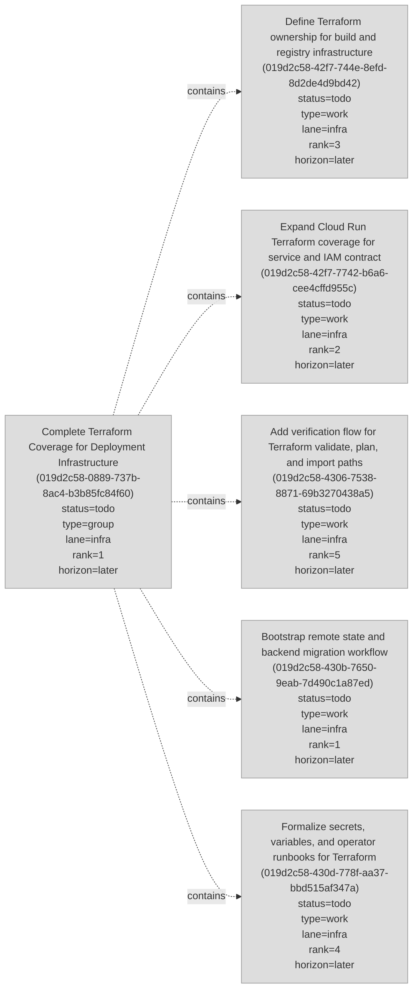

# Ticket portfolio graph
_Generated at 20260328T232733.752Z UTC_

```mermaid
graph LR
  n0["Complete Terraform Coverage for Deployment Infrastructure\n(019d2c58-0889-737b-8ac4-b3b85fc84f60)\nstatus=todo\ntype=group\nlane=infra\nrank=1\nhorizon=later"]:::status_todo
  click n0 "/.tickets/019d2c58-0889-737b-8ac4-b3b85fc84f60/ticket.md" "_blank"
  n1["Define Terraform ownership for build and registry infrastructure\n(019d2c58-42f7-744e-8efd-8d2de4d9bd42)\nstatus=todo\ntype=work\nlane=infra\nrank=3\nhorizon=later"]:::status_todo
  click n1 "/.tickets/019d2c58-42f7-744e-8efd-8d2de4d9bd42/ticket.md" "_blank"
  n2["Expand Cloud Run Terraform coverage for service and IAM contract\n(019d2c58-42f7-7742-b6a6-cee4cffd955c)\nstatus=todo\ntype=work\nlane=infra\nrank=2\nhorizon=later"]:::status_todo
  click n2 "/.tickets/019d2c58-42f7-7742-b6a6-cee4cffd955c/ticket.md" "_blank"
  n3["Add verification flow for Terraform validate, plan, and import paths\n(019d2c58-4306-7538-8871-69b3270438a5)\nstatus=todo\ntype=work\nlane=infra\nrank=5\nhorizon=later"]:::status_todo
  click n3 "/.tickets/019d2c58-4306-7538-8871-69b3270438a5/ticket.md" "_blank"
  n4["Bootstrap remote state and backend migration workflow\n(019d2c58-430b-7650-9eab-7d490c1a87ed)\nstatus=todo\ntype=work\nlane=infra\nrank=1\nhorizon=later"]:::status_todo
  click n4 "/.tickets/019d2c58-430b-7650-9eab-7d490c1a87ed/ticket.md" "_blank"
  n5["Formalize secrets, variables, and operator runbooks for Terraform\n(019d2c58-430d-778f-aa37-bbd515af347a)\nstatus=todo\ntype=work\nlane=infra\nrank=4\nhorizon=later"]:::status_todo
  click n5 "/.tickets/019d2c58-430d-778f-aa37-bbd515af347a/ticket.md" "_blank"
  n0 -.->|contains| n1
  n0 -.->|contains| n2
  n0 -.->|contains| n3
  n0 -.->|contains| n4
  n0 -.->|contains| n5
  classDef status_todo fill:#ddd,stroke:#999;
  classDef status_doing fill:#d0e7ff,stroke:#3b82f6;
  classDef status_blocked fill:#ffe4e6,stroke:#ef4444;
  classDef status_done fill:#dcfce7,stroke:#22c55e;
  classDef status_canceled fill:#f3f4f6,stroke:#111827,color:#374151;
```